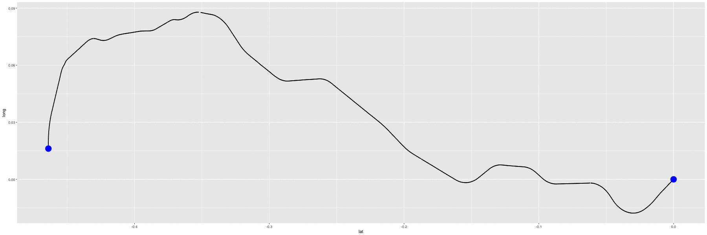
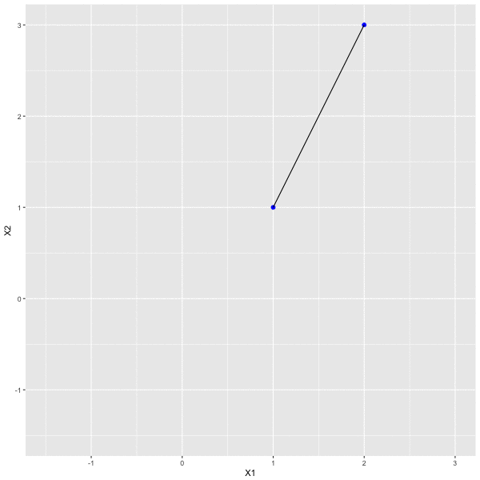

# How to generate the RDP polygon

  
Basically we are using the two existing points (in this case, the starting and end points of a path) to 
generate two pairs of points, each pair shares certain same distance, say $\epsilon$, to the existing points. 

## Solution

We can first think about the problem of transforming (panning and rotation which do not affect the shape and relative distance) the two existing points, say $(x_1,y_1)$ and $(x_2,y_2)$ into points so that their polygon points can be easily found, e.g., points both laying on X axis. Then we impose reverse transformation over the polygon points, the resulting points will then be what we want.

## Two-step Transformation

We can use two steps to transform $(x_1,y_1)$ and $(x_2,y_2)$ onto X axis.

1. Panning: $[(x_1,y_1),(x_2,y_2)] \rightarrow [(\frac{x_1-x_2}{2},\frac{y_1-y_2}{2}),(\frac{x_2-x_1}{2},\frac{y_2-y_1}{2})]$

*NB: we set the middle point to be $(0,0)$ so that the following rotation does not affect the shape of polygon.*

2. Rotation: rotate the line linking the two points by $-\theta$, where $\theta = \arctan(\frac{y_2-y_1}{x_2-x_1})$.

Let $d = \sqrt{(x_2-x_1)^2+(y_2-y_1)^2}$, the transformation results in two points $(-d,0)$ and $(d,0)$. Then the polygon points for them can be easily found: $(-\frac{d}{2},-\frac{\epsilon}{2}), (-\frac{d}{2},\frac{\epsilon}{2})$ and $(\frac{d}{2},-\frac{\epsilon}{2}), (\frac{d}{2},\frac{\epsilon}{2})$.

## Reverse Transformation

With the transformation being done in mind, we can impose the reversed transformation over the specified polygon points. 